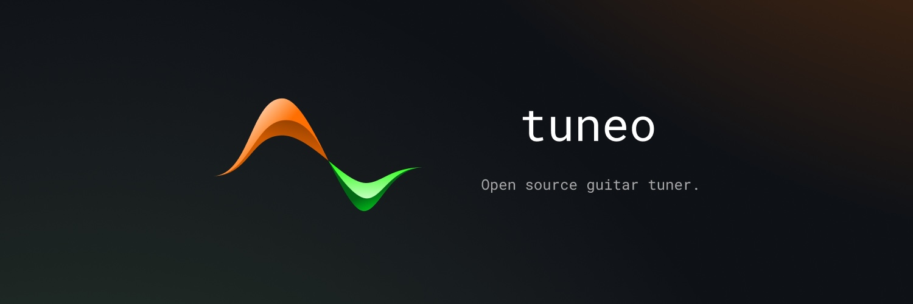

## 🎸 A React Native Guitar Tuner

An open-source guitar tuner app built with React Native, leveraging the new bridgeless architecture to achieve real-time pitch detection and smooth UI updates.

> [!IMPORTANT]
> **We're currently looking for testers!**
> 
> Reach us on Instagram (**@tuneo.app**) or email (**braulioriosf@gmail.com**) so we can add you to the list of testers and you'll be able to install it immediately from the App Store (iOS) or PlayStore (Android).

- Android users: We need at least 12 testers to install the app for 14 days in order to publish it for Android.

- iOS users: The app is currently in review to get approval for the App Store, so for now it's only available for listed testers.

## 🔥 Features

- Real-time Pitch Detection: Uses a C++ TurboModule for efficient pitch estimation using the YIN algorithm.
- Smooth & Interactive UI: Built with [Skia](https://shopify.github.io/react-native-skia/) and [Reanimated 3](https://docs.swmansion.com/react-native-reanimated/).
- Cross-Platform: Runs on both iOS and Android with a shared codebase.
- Native Audio Modules: Uses custom built Swift (iOS) and Kotlin (Android) modules for microphone access.
- **Open Source:** No ads, no paywalls—just a functional and efficient tuner. Sponsors/donations are welcome to support development!

## 🤓 Technical Overview

### Why Use React Native's New Architecture?

This project demonstrates a use case that would be impractical with the old React Native bridge. The new TurboModules allow direct and efficient communication between JavaScript, native modules and C++, avoiding performance bottlenecks caused by JSON serialization.

Additionally, Skia and Reanimated 3 enable a game-like, smooth UI that updates in real-time without lag—something difficult to achieve with standard React Native views.

### Why React Native in the first place?

This project was developed with a fraction of the effort that would be necessary using alternatives, because it combines a high-level language (Typescript/JSX) that allows very fast development cycles, with low-level modules (C++/Swift/Kotlin) for performance in tasks like signal processing, drawing, and animations.

Also, the codebase for iOS and Android is shared, except for the microphone access native modules, which are very small and were generated using AI tools for the most part, because I didn't have time to dive deeper in Swift and Kotlin 😁. The C++ signal processing module is cross-platform by design, requiring no modifications for iOS and Android.

### Getting started

If you are a developer and want to dive in, here's the basics you need to know:

1.  The app starts as a React Native (TypeScript) navigation app using Expo.
2.  The main screen (`src/navigation/screens/Tuneo.tsx`) is a Skia canvas that displays the tuning interface.
3.  When the app starts, it initializes the native microphone module (ios/android in `modules/microphone-stream`), which streams raw audio buffers to JavaScript.
4.  For each audio buffer received:
    - The waveform is drawn on the UI using Skia and Reanimated.
    - The buffer is sent to the C++ pitch detection module (`shared/NativeDSPModule.cpp`), which estimates the pitch in real time.
5.  The detected pitch is displayed on the UI, along with a real-time pitch evolution graph to help with tuning.

### Notes:

- The `notebooks/` folder contains a python/jupyter notebook to experiment with the YIN algorithm offline.
- The C++ turbo module for pitch detection was integrated following the [React Native docs](https://reactnative.dev/docs/0.77/the-new-architecture/pure-cxx-modules).
- The Swift/Kotlin native modules for microphone access were implemented with [Expo](https://docs.expo.dev/modules/native-module-tutorial/).
- The whole project was started using the React Navigation [Starter Template](https://reactnavigation.org/docs/getting-started#starter-template).

## 🎯 Future Improvements

This is just a list of ideas, which might change according to user feedback.

- Support for more instruments.
- Improved UI/UX design.
- Add metronome and some basic ear training challenges.
- Experimentation with alternative pitch detection algorithms (e.g., CREPE).
- Better developer documentation.
- Localization for multiple languages.

## 🤝 Contributing & Sponsorship

This is an open-source project, but it has the potential to evolve into a serious tool if it gains traction. Contributions and sponsorships are welcome to support ongoing development.

If you find this project useful, consider sponsoring via GitHub to help improve and maintain it!

## 📜 License

This project is open-source, but redistribution as a competing commercial app is prohibited. See the LICENSE file for details (based on MIT with an added restriction on app store competition).

Feel free to use the code for personal or non-competing commercial projects. If you have any questions about usage, please don't hesitate to reach out!
